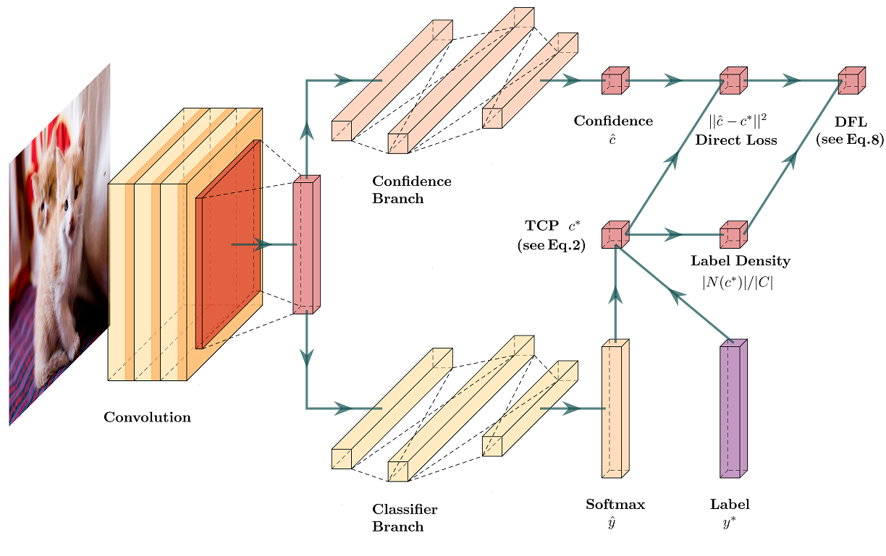

# balanced-TCP
This project is an experimental implementation of the paper "Balance Calibration for Identifying Incorrect Classifications with Distinguishable Uncertainty" (under review in ACML 2021).

# dataset extension
Override new subclass of torch.utils.data.Dataset  
Implement init(), __getitem__() and __len__()  
Save your code into balanced-TCP/helpers/MyDataset.py

# network extension
Setup a new .py file into balanced-TCP/models/  
Inherit torch.nn.Module  
Implement init() and forward()  
Follow the examples given in balanced-TCP/models/

# experiment extension
Setup a new .yaml file into balanced-TCP/conf/  
Follow the examples given in balanced-TCP/conf/  
Revise balanced-TCP/RUNME.sh for detailed settings
